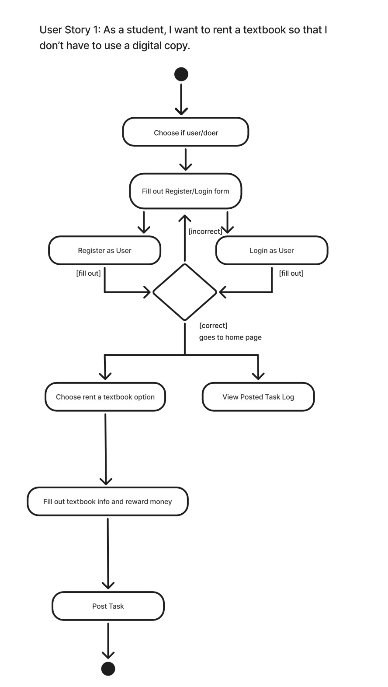

# Specification Phase Exercise

A little exercise to get started with the specification phase of the software development lifecycle. See the [instructions](instructions.md) for more detail.

## Team members
Alvaro Martinez

Git Link: https://github.com/AlvaroMartinezM

Danny brito
Git Link: https://github.com/danny031103 

Jun Li
Git Link: https://github.com/jljune9li 

Natalie Ovcarov

Git Link: https://github.com/nataliovcharov

## Stakeholders

Jahleel Townsend: 

See instructions. Delete this line and replace with the name(s) of the stakeholder(s) you interviewed and lists showing their goals/needs, and problems/frustrations.

## Product Vision Statement

Our mobile app enhances student life by offering a platform where students can conveniently find and hire peers for various tasks.

## User Requirements

1. As a student, I want help moving so that I don’t have to carry heavy things alone.
2. As a student, I want a used textbook, so I don’t have to spend too much money on a new one.
3. As a student, I want to make extra money so that I can pay rent.
4. As a student, I want to get food delivery from the dining hall so I can stay home and enjoy my food at a more reasonable price
5. As a student, I want help cleaning my room/bathroom so I can focus more on my studies and other priorities.
6. As a student, I want tutoring from other students so I can do better at my classes.
7. As a student, I want assistance with laundry because I don’t know how to do it properly/don’t have time to do it.
8. As a student, I want to rent a textbook so that I don’t have to use a digital copy.
9. As a student, I want help moving so that I don’t have to rent a truck.
10. As a student, I want to find carpooling options so I can reduce transportation costs and help the environment.
11. As a student, I want to offer moving help so I can earn extra money from those who need help carrying heavy items.

## Activity Diagrams
### Activity Diagram 1: As a student, I want to make extra money so that I can pay rent.

### Activity Diagram 2: As a student, I want to rent a textbook so that I don’t have to use a digital copy.

## Clickable Prototype

See instructions. Delete this line and place a publicly-accessible link to your clickable prototype here.
